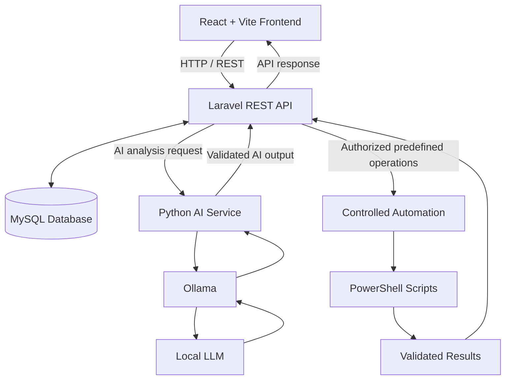

# 🛡️ SentinelForge

### Engineering Security. Understanding Intelligence. Building Solutions.

**SentinelForge** is a progressive cybersecurity engineering and problem-solving platform designed to explore, understand, and practice real-world concepts in **Cybersecurity, Network Engineering, Artificial Intelligence, Local LLMs, Software Development, and Defensive Automation.**

The core idea is simple:

> **Don't just learn how technology works. Build systems, investigate problems, experiment safely, and understand how everything connects.**

SentinelForge combines multiple technologies into one integrated engineering environment, where every feature serves a purpose: solving a problem, understanding a concept, or developing practical technical skills.

---

## 🎯 The Problem We Are Solving

Cybersecurity, artificial intelligence, networking, and software engineering are often learned as separate subjects.

Developers may understand how to build web applications but lack practical experience with security monitoring, incident investigation, system-level operations, or AI-assisted analysis.

Similarly, learning about LLMs, network behavior, security events, and automation independently does not necessarily provide an understanding of how these technologies can work together in a real system.

**SentinelForge addresses this learning gap by bringing these concepts into one practical, integrated engineering project.**

The platform is intended to explore questions such as:

* How can security events be collected, structured, and analyzed?
* How can a web application support security monitoring and incident investigation?
* How can local LLMs assist with understanding security-related information?
* How can network engineering concepts be explored through practical tools and analysis?
* How can defensive automation simplify repetitive security operations?
* How do authentication, authorization, APIs, databases, and system boundaries contribute to application security?
* How can AI-assisted analysis remain explainable, controlled, and secure?

The goal is not simply to create another dashboard. It is to build a system that helps bridge the gap between theoretical knowledge and practical engineering.

---

## 🧠 The Core Heart of SentinelForge

SentinelForge is built around a continuous engineering cycle:

**Learn → Build → Test → Secure → Investigate → Understand → Improve**

Each component has an educational and practical purpose.

| Core area               | Intention                                                                                                   |
| ----------------------- | ----------------------------------------------------------------------------------------------------------- |
| Cybersecurity           | Understand security principles, threats, vulnerabilities, defensive practices, and incident handling.       |
| Network Engineering     | Explore network fundamentals, communication, traffic-related concepts, and network security.                |
| Artificial Intelligence | Understand how AI can assist with security analysis while maintaining human oversight.                      |
| Local LLMs              | Experiment with offline, locally hosted language models using Ollama.                                       |
| Software Engineering    | Apply architecture, REST APIs, database design, authentication, testing, and maintainable coding practices. |
| Defensive Automation    | Use controlled scripts to perform predefined security and system administration tasks.                      |
| Problem Solving         | Turn security and engineering challenges into practical, testable solutions.                                |
| Continuous Learning     | Develop the ability to understand, explain, debug, and improve an integrated technical system.              |

---

## ⚙️ Technology Stack

SentinelForge brings together technologies from different engineering domains.

| Technology        | Purpose                                                                                 |
| ----------------- | --------------------------------------------------------------------------------------- |
| React             | Interactive frontend and security dashboard                                             |
| JavaScript        | Frontend logic, API integration, and application interactions                           |
| Vite              | Frontend development and build tooling                                                  |
| PHP               | Backend application development                                                         |
| Laravel           | REST APIs, authentication, authorization, business logic, and data management           |
| MySQL             | Structured storage for users, security events, incidents, and related application data  |
| Python            | Local AI service and LLM integration                                                    |
| Ollama            | Running local language models without depending on cloud-based LLM APIs                 |
| PowerShell        | Controlled defensive automation and Windows security operations                         |
| HTML & CSS        | Web interface structure and styling                                                     |
| REST APIs         | Communication between the frontend and backend and integration with supporting services |
| Desktop packaging | Exploring standalone desktop application delivery and local execution                   |

---

## 🏗️ System Architecture

SentinelForge follows a modular architecture in which each technology has a clearly defined responsibility.

### Architecture responsibilities

* **React + Vite:** Provides the user interface for interacting with security features, viewing information, and managing investigations.
* **Laravel:** Acts as the central application backend, responsible for validation, authentication, authorization, business rules, database access, and service coordination.
* **MySQL:** Stores structured application data, including security events, incidents, and audit information.
* **Python + Ollama:** Provides a dedicated local AI integration layer for processing and analyzing information with locally hosted language models.
* **PowerShell:** Performs explicitly defined defensive operations within controlled execution boundaries.
* **Desktop packaging:** Provides a direction for exploring a standalone desktop experience, including local application usage.

Each layer communicates through explicit contracts rather than sharing unrestricted responsibilities.

---

## 🔍 Key Concepts and Planned Capabilities

SentinelForge is developed progressively, with features introduced as the underlying concepts become understood and tested.

### 🛡️ Security Monitoring and Event Analysis

* Security event collection and structured storage.
* Security dashboards and event summaries.
* Event filtering and investigation.
* Analysis of suspicious or unusual activity.
* Audit logging and traceability.

### 🔎 Incident Investigation

* Incident creation and management.
* Investigation workflows.
* Event-to-incident relationships.
* Incident status and tracking.
* Structured investigation records.

### 🧠 AI-Assisted Security Analysis

* Local LLM integration using Ollama.
* Python-based AI processing.
* Structured prompts and output validation.
* AI-assisted event interpretation.
* Explainable analysis and recommendations.
* Handling malformed outputs, timeouts, and model failures.

### 🌐 Network Engineering and Security

* Network fundamentals and communication concepts.
* Understanding network-related security events.
* Exploring network security practices.
* Learning about traffic analysis and network behavior.
* Building controlled educational experiments.

### ⚡ Defensive Automation

* Windows security checks.
* Predefined PowerShell operations.
* Controlled automation workflows.
* Input validation and result parsing.
* Automation error handling.
* Auditable execution.

### 🔐 Secure Application Engineering

* Authentication and session security.
* Role-based access and authorization.
* API validation and access control.
* Secure database interactions.
* Protection against common web vulnerabilities.
* Automated testing and security-focused debugging.

---

## 🔒 Security by Design

Security is not an optional feature of SentinelForge. It is a fundamental engineering requirement.

The project emphasizes:

* **Zero trust in external input:** Validate and handle all external input as untrusted.
* **Server-side authorization:** Laravel remains the authoritative source for access decisions.
* **Controlled automation:** Only predefined and authorized operations can be executed.
* **Safe AI integration:** AI output is treated as untrusted data and never executed blindly.
* **Secure API design:** Apply authentication, authorization, validation, and appropriate request controls.
* **Auditability:** Record important actions to support investigation and accountability.
* **Failure handling:** Design for unexpected inputs, service failures, invalid model output, and operational errors.
* **Controlled experimentation:** Keep security exercises within authorized and isolated environments.

The platform is intended for educational and defensive security engineering, not unauthorized access or uncontrolled exploitation.

---

## 📚 Learning Through Engineering

SentinelForge is also a personal engineering laboratory.

Instead of treating every technology as an isolated tutorial, the project uses practical implementation to understand how individual components work and how their interactions affect the whole system.

The learning process follows a progressive structure:

1. **Foundation:** Build the web application, database, REST APIs, and basic authentication.
2. **Application Security:** Introduce authorization, validation, audit logging, and security controls.
3. **Cybersecurity Concepts:** Develop security events, incident workflows, and investigation capabilities.
4. **AI Integration:** Connect Python with Ollama and implement reliable, structured AI-assisted analysis.
5. **Defensive Automation:** Integrate controlled PowerShell operations and validate their results.
6. **Advanced Engineering:** Explore performance, reliability, testing, architecture, and system hardening.

Each stage builds on the previous one. The objective is to understand not only how to implement a feature but also why it exists, what problems it solves, what risks it introduces, and how to verify its behavior.

---

## 🚀 Project Vision

The long-term vision for SentinelForge is to develop an integrated cybersecurity engineering environment that combines:

* Security monitoring and investigation.
* Network security learning and analysis.
* Local AI-assisted security intelligence.
* Controlled defensive automation.
* Secure web application engineering.
* Standalone desktop application exploration.
* Practical security exercises and technical experimentation.

Ultimately, SentinelForge aims to demonstrate how modern software engineering, local artificial intelligence, cybersecurity principles, and system automation can work together in a single understandable platform.

It is an evolving engineering project, not a claim of being a complete SIEM, enterprise security product, or production-ready security operations platform.

---

## 🧭 Project Philosophy

> **Build to understand. Break safely to learn. Secure to improve. Explain to master.**

SentinelForge is guided by a few principles:

* Simplicity before unnecessary complexity.
* Understanding before abstraction.
* Security before convenience.
* Testing before trusting.
* Human oversight over blind automation.
* Local experimentation wherever practical.
* Continuous improvement through real engineering challenges.

The ultimate measure of progress is not the number of technologies used or features added. It is the ability to design, build, secure, test, debug, and clearly explain the system.

---

## 📌 Project Status

**Status:** Active development and progressive learning.

SentinelForge is being built in stages. Architecture, features, and integrations will evolve as the foundational components are implemented, tested, and understood.

Features described in this README represent the project's goals and intended capabilities. They should not be interpreted as a claim that every feature is already implemented.

---

## 👨‍💻 Author

**Strider**
Software Engineer | Full-Stack Development | Cybersecurity Engineering | AI Exploration

Building SentinelForge to explore the intersection of software engineering, cybersecurity, local AI, and defensive automation.

---

**SentinelForge — Learn the systems. Understand the risks. Engineer the solutions.**
